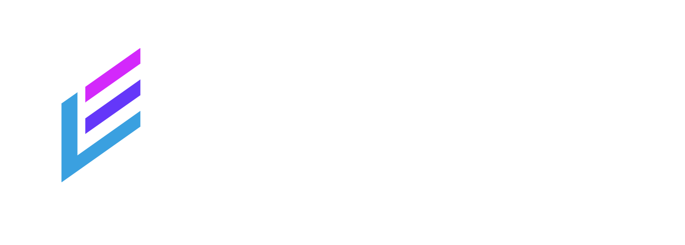

  

<!-- Logo -->
 

  
  

    Welcome to my company project!
  

<!-- TABLE OF CONTENTS -->

  
Table of Contents

  <ol>
    <li>
      <a href="#about-the-project">About The Project</a>
      <ul>
        <li><a href="#built-with">Built With</a></li>
      </ul>
    </li>
    <li>
      <a href="#getting-started">Getting Started</a>
      <ul>
        <li><a href="#prerequisites">Prerequisites</a></li>
        <li><a href="#installation">Installation</a></li>
      </ul>
    </li>
    <li><a href="#usage">Usage</a></li>
    <li><a href="#roadmap">Roadmap</a></li>
    <li><a href="#contributing">Contributing</a></li>
    <li><a href="#license">License</a></li>
    <li><a href="#contact">Contact</a></li>
    <li><a href="#acknowledgments">Acknowledgments</a></li>
  </ol>

  <!-- ABOUT THE PROJECT -->
  ## About The Project

  LearnEdge is a Online Course app.
  Design for Mitca Studios.

  Why i choose this project:
  * The reason i chose this kind of project is because the company that i'm on works with projects for education so i thought what's better than a Online Course app :smile:

  The idea of the project is simple the users are able to create their accounts as a students or teachers and depend in what role you choose you will be able to create courses and add content to them (teacher) or join courses and see their content (students) 

  
(<a href="#readme-top">back to top</a>)

  ### Built With

  This is the technologies that i had to use for this project, company chose.

  * [![Express][Express.js]][Express-url]
  * [![React][React.js]][React-url]
  * [![Mongoose-ODM][Mongoose-ODM]][Mongoose-url]
  * [![Mongodb][Mongodb]][Mongodb-url]

  
(<a href="#readme-top">back to top</a>)

  [Express.js]: https://img.shields.io/badge/express.js-000000?style=for-the-badge&logo=express&logoColor=white
  [Express-url]: https://expressjs.com/
  [React.js]: https://img.shields.io/badge/React-20232A?style=for-the-badge&logo=react&logoColor=61DAFB
  [React-url]: https://reactjs.org/
  [Mongoose-ODM]: https://img.shields.io/badge/mongoose-FFA500?style=for-the-badge&logo=mongoose&logoColor=white
  [Mongoose-url]: https://mongoosejs.com/
  [Mongodb]: https://img.shields.io/badge/mongodb-47A248?style=for-the-badge&logo=mongodb&logoColor=white
  [Mongodb-url]: https://www.mongodb.com/