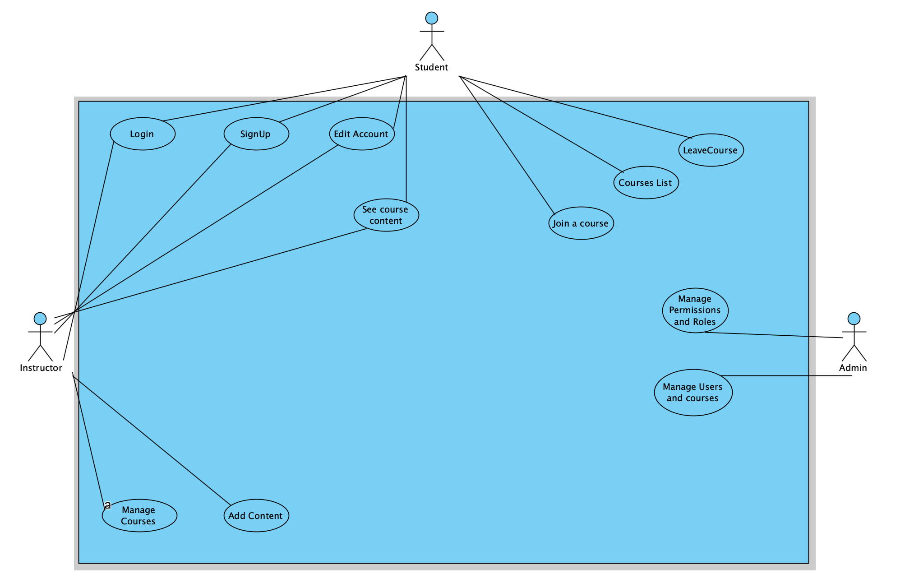

<a name="readme-top"></a>

<div align="center">
  <a href="https://linkedin.com/in/josemiguelbravomendez">
    
  </a>
</div>

<!-- Logo -->
<br />
<div align="center">
  
  <p align="center">
    Welcome to my company project!
  </p>
</div>

<!-- TABLE OF CONTENTS -->
<details>
  <summary>Table of Contents</summary>
  <ol>
    <li>
      <a href="#about-the-project">About The Project</a>
      <ul>
        <li><a href="#built-with">Built With</a></li>
      </ul>
    </li>
    <li><a href="#roadmap">RoadMap</a></li>
    <li><a href="#figma">Figma</a></li>
    <li><a href="#backend">Backend</a></li>
    <li><a href="#diagrams">Diagrams</a></li>
    
  </ol>
</details>

## About The Project

LearnEdge is a Online Course app.
Design for Mitca Studios.

Why I choose this project:
* The reason I chose this kind of project is because the company that i'm on works with projects for education so I thought what's better than a Online Course app :smile:

The idea of the project is simple the users are able to create their accounts as a students or teachers and depend in what role you choose you will be able to create courses and add content to them (teacher) or join courses and see their content (students) 

<p align="right">(<a href="#readme-top">back to top</a>)</p>

## Built With

This is the technologies that I had to use for this project, company chose.

* [![Express][Express.js]][Express-url]
* [![React][React.js]][React-url]
* [![Mongoose-ODM][Mongoose-ODM]][Mongoose-url]
* [![Mongodb][Mongodb]][Mongodb-url]


<p align="right">(<a href="#readme-top">back to top</a>)</p>

## RoadMap

For this project I have followed the Roadmap from Git(Projects) as our theacher request.
<br></br>


## Figma

The mockup has been made in <a href="https://www.figma.com/file/avrlJiOeIneXq5CDVriOe9/Mitca?type=design&node-id=0-1&mode=design&t=VaqrBnWqjKm7dp3e-0">Figma.</a>
  
<p align="right">(<a href="#readme-top">back to top</a>)</p>

## Backend

Let's start installing our project. First backend.
  
1. npm
    ```sh
      npm install npm@latest -g
    ```
2. Clone the repo
    ```sh
      git clone https://github.com/Canariiii/LearnEdge
    ```
3. Go to the dir backend/    
    ```sh
       cd learnedge/backend/
    ```
4. Install NPM packages
    ```sh
       npm install
    ```
    
### Diagrams
<h1>Tree Diagram</h1>
</img>
<h2>Data Model</h2>
<p>
  In this project the main CRUD is made in the model Courses because every single class has something to do with it. As a nonSql database our AED teacher told us to do no more than 2 levels.
</p>
<h2>User Case<h2>
</img>
  
<p> <p align="right">(<a href="#readme-top">back to top</a>)</p></p>

[Express.js]: https://img.shields.io/badge/express.js-000000?style=for-the-badge&logo=express&logoColor=white
[Express-url]: https://expressjs.com/
[React.js]: https://img.shields.io/badge/React-20232A?style=for-the-badge&logo=react&logoColor=61DAFB
[React-url]: https://reactjs.org/
[Mongoose-ODM]: https://img.shields.io/badge/mongoose-FFA500?style=for-the-badge&logo=mongoose&logoColor=white
[Mongoose-url]: https://mongoosejs.com/
[Mongodb]: https://img.shields.io/badge/mongodb-47A248?style=for-the-badge&logo=mongodb&logoColor=white
[Mongodb-url]: https://www.mongodb.com/